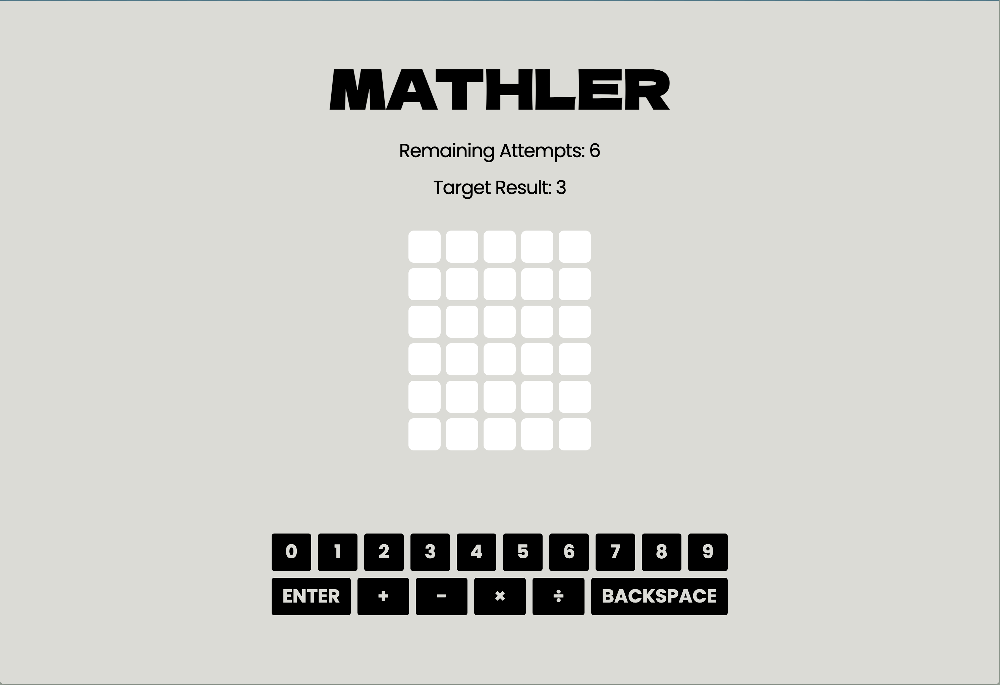
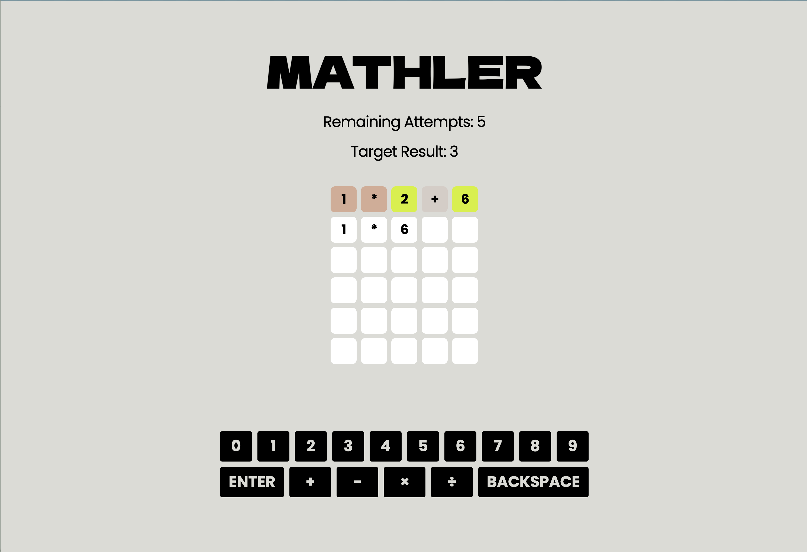
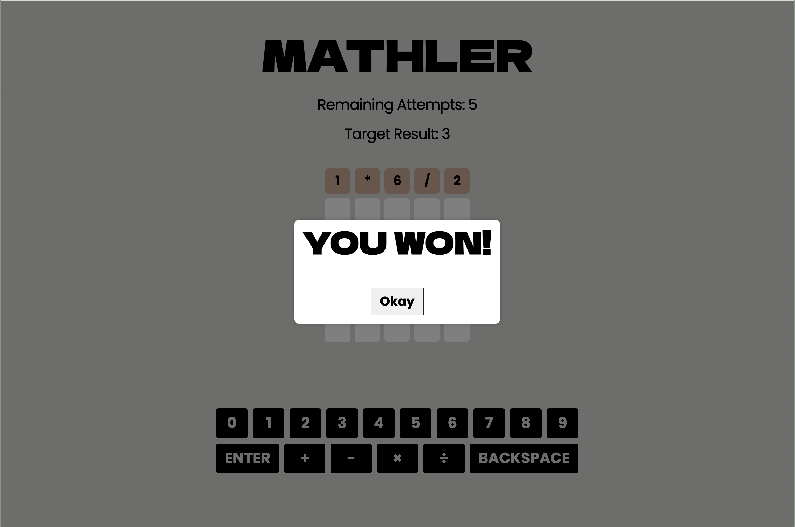
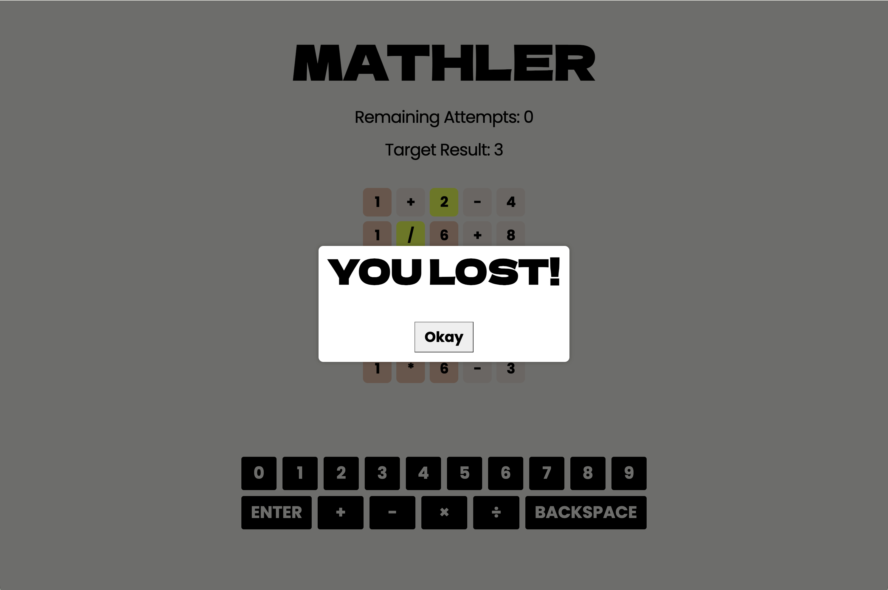

# Mathler

### Overview

Mathler is a React application written in Typescript built with Vite/Vitest with TailwindCSS and PostCSS [Cube.CSS](https://cube.fyi/principles.html).

### Setup

1. Download the repository:
```
git clone git@github.com:kylewludwig/mathler-game.git
```

2. Run it in your local environment:
```
yarn install
yarn dev
```

3. Test it in your local environment:
```
yarn test
```

### Game Rules
Similar to Wordle, Mathler provides a target result and six guesses to find a matching expression for the equation of the day.
- Numbers and operators can appear multiple times.
- Order of operation applies (* and / are calculated before + and -)
- After each guess, the color of the tiles should change to reflect the status (green if it’s in the right spot, yellow if it’s is part of the equation but in the wrong spot, grey if it’s not part of the equation at all)
- Should accept cumulative solutions (e.g. 1+5*15 === 15*5+1)

### How it Works

Mathler displays the result for the hidden math equation and remaining attempts to guess the expression, which is equal to the number of rows.



You then enter your guess into the tiles using the keyboard below the game board. Once you submit your guess, matched tiles will be green, present tiles yellow, and absent tiles grey.



Once all tiles are green, you win!



But if you run out of guesses before matching the expression, you lose!



 Remember, the order of the expression matters even if it returns the same result!